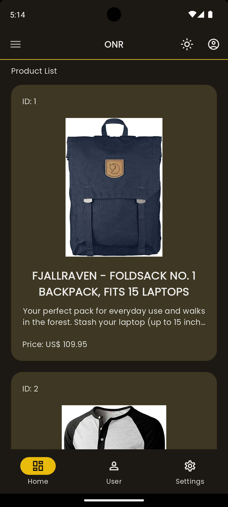
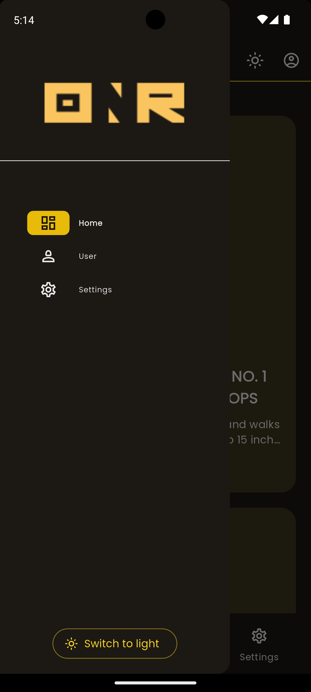
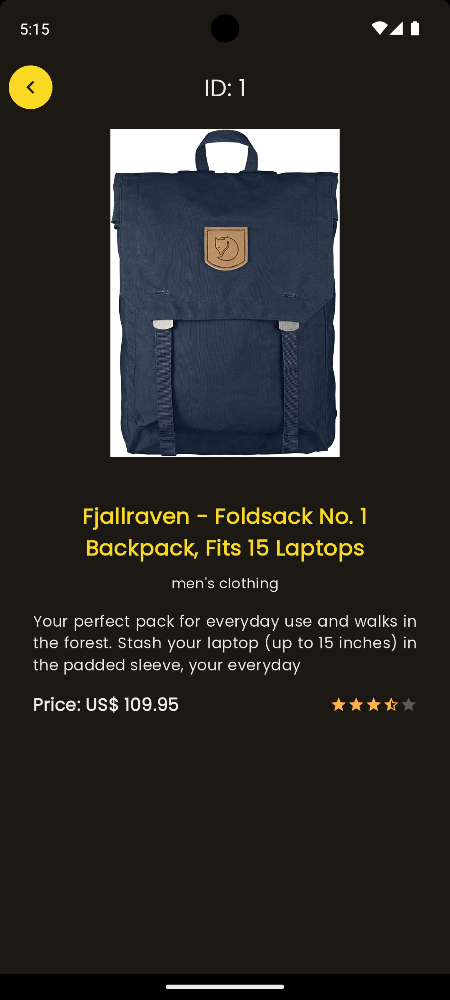
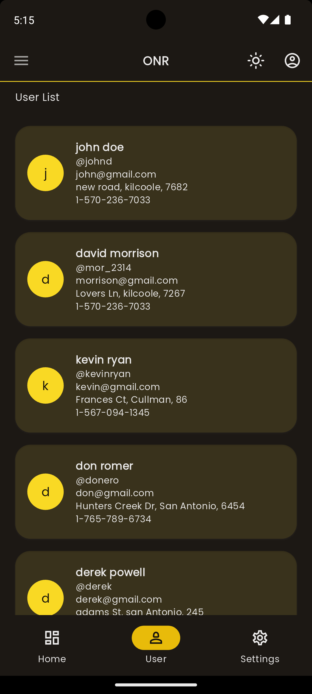
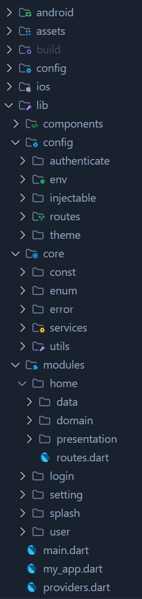

# store_app

A new Flutter project.

## Screenshots

<br>
<p align="center">






</p>

## Using on this app

- Clean Architecture
- BLoC
- go_route
- GetIt
- freezed
- either
- http
- [FakeStore API](https://fakestoreapi.com/)

## Clean Architecture Diagram





## How to use

To clone and run this application, you'll need [Git](https://git-scm.com/downloads) and [Flutter](https://flutter.dev/docs/get-started/install) installed on your computer. From your command line:

```
# Clone this repository
$ git clone https://github.com/andresroviram/store_app.git

# Go into the repository
$ cd store_app

# Install dependencies
$ flutter pub get

# Create archive .env
$ API_KEY=''
$ BASE_URL='https://fakestoreapi.com'

# generate codes
$ dart run build_runner build --delete-conflicting-outputs

# Run the app
$ flutter run

# Account Sessión (Login)
$ admin@gmail.com
$ 123
```
